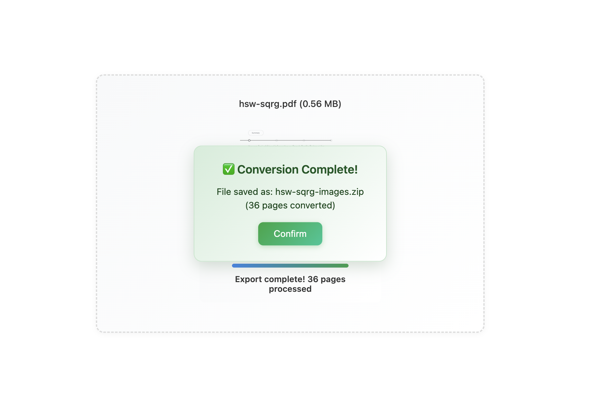

# PDFto.Tools



🚀 **PDFto.Tools** is a powerful, client-side PDF toolkit built with WebAssembly (WASM). Convert PDFs to **DOCX, PNG, Excel, CSV, PPT**, and more—all locally in your browser. No server-side processing means your data remains 100% private and secure.

> **Note:** This project offers a web interface only and does not provide a public API. If you need to integrate it into your own system, feel free to fork the repository and adapt the source code to your needs.

---

## Live Demo

- **Official Website:** <https://pdfto.tools>

All conversions run directly in your browser, so you can convert sensitive files with complete peace of mind.

---

## How to Use

1.  **Choose a tool:** Select a conversion format from the sidebar, like "PDF to PNG."
2.  **Upload your file:** Click the "Upload" button or drag and drop your PDF into the designated area.
3.  **Wait for the conversion:** The process starts automatically. Large files might take a few moments to process.
4.  **Download your file(s):** Once finished, download your converted files individually or as a single ZIP archive.

---

## Why PDFto.Tools?

-   **100% Private:** All operations happen locally in your browser. Your files are never uploaded to a server, and we don't collect any user data.
-   **Fast and Efficient:** Powered by WebAssembly, our tools are fast and resource-friendly, handling even large PDFs with ease.
-   **Easy Deployment:** No complex backend setup required. Deploy it as a static site or use Cloudflare Workers for a seamless setup.

---

## Deployment

## Deployment

### Cloudflare Workers

This project is pre-configured with a `wrangler.toml` file for easy deployment to Cloudflare Workers, providing a global CDN and HTTPS out of the box.

> **Note:** Before deploying, make sure you have a Cloudflare account and have configured your `account_id` in the `wrangler.toml` file.

```bash
# 1. Fork and clone the repository
$ git clone https://github.com/your-username/tools.git
$ cd tools

# 2. Install the Wrangler CLI
$ pnpm i -g wrangler

# 3. Log in to your Cloudflare account
$ wrangler login

# 4. Deploy to Workers
$ wrangler deploy
```

After deploying, you can access your instance via the domain assigned by Cloudflare, such as:
`https://pdfto-tools.<your-account>.workers.dev`

> If you have a custom domain, you can configure it for this Worker in your Cloudflare Dashboard.

### Static Site Hosting

You can also deploy this project as a static site on any platform like **Cloudflare Pages**, Vercel, or Netlify.

```bash
# 1. Install dependencies
$ pnpm install

# 2. Build the project
$ pnpm build
```

Once the build is complete, upload the `dist/` directory to your static hosting platform.

---

## Key Features

| Feature                        | Description                                                                          |
| ------------------------------ | ------------------------------------------------------------------------------------ |
| **Zero Server-Side Dependencies** | All conversion logic runs in the browser. No files are ever uploaded or collected.   |
| **Multiple Output Formats**    | Supports DOCX, PNG, XLSX/CSV, PPTX, and more.                                        |
| **Stream-Powered Processing**  | Handles large files smoothly with WASM and the Streams API.                          |
| **Open Source & Customizable** | Feel free to fork, modify, or embed it in your own web applications.                 |

---

## How It Works

The magic behind PDFto.Tools is **WebAssembly (WASM)**. We compile mature, battle-tested PDF libraries (like PDFium and LibreOffice) into a format that runs directly in the browser. When you upload a file, the entire process happens inside a secure browser sandbox:

1.  **File Reading:** The browser reads your local PDF file using the `FileReader` or `Streams API`.
2.  **WASM Initialization:** JavaScript passes the file data to the WASM module.
3.  **Core Processing:** The WASM module processes the file in an isolated memory space, converting it into your desired format (e.g., a PNG image or a DOCX document).
4.  **Result Hand-off:** The WASM module returns the converted file data back to JavaScript.
5.  **Download:** The browser serves the result back to you as a downloadable file using a `Blob` or `FileSaver.js`.

This architecture not only guarantees absolute data privacy but also leverages the full power of modern browsers to deliver performance that rivals native applications.

---

## Status & Roadmap

-   **Current Status:** `Beta` - The core features are ready to use, but you might encounter a few bugs.
-   **Roadmap:**
    -   [ ] **PDF ➜ JPG/WEBP Conversion**
    -   [ ] **PDF Compression**
    -   [ ] **PDF Merging & Splitting**
    -   [ ] **UI/UX Enhancements**

We'd love your feedback! Feel free to open an [Issue](https://github.com/pdfto-tools/tools/issues) or submit a [Pull Request](https://github.com/pdfto-tools/tools/pulls).

---

## Tech Stack

-   **WebAssembly (WASM):** Core Conversion Engine
-   **TypeScript + Vite:** Frontend Development & Bundling
-   **Wrangler:** Cloudflare Workers Deployment
-   **Playwright:** E2E Testing

---

## Local Development

```bash
# 1. Install dependencies
$ pnpm install

# 2. Start the local dev server
$ pnpm dev
```

---

## Browser Compatibility

| Browser | Required Version |
| ------- | ---------------- |
| Chrome  | 94+              |
| Edge    | 94+              |
| Firefox | 90+              |
| Safari  | 15+              |

> Mobile browsers must support `WebAssembly` and `ReadableStream`.

---

## Contributing

Contributions of all kinds are welcome! If you'd like to get involved, please follow these steps:

1.  **Fork** this repository.
2.  **Clone** your forked repository to your local machine.
3.  **Install dependencies:**
    ```bash
    $ pnpm install
    ```
4.  **Create a new branch:**
    ```bash
    $ git checkout -b feature/your-awesome-feature
    ```
5.  **Make your changes** and **commit** them:
    ```bash
    $ git commit -m 'feat: Add your awesome feature'
    ```
6.  **Push** to your remote repository:
    ```bash
    $ git push origin feature/your-awesome-feature
    ```
7.  **Open a Pull Request**.

Before submitting, please ensure your code passes the lint and test checks:

```bash
# Run the linter
$ pnpm lint

# Run tests
$ pnpm test
```

---

## License

This project is released under the **MIT License**.